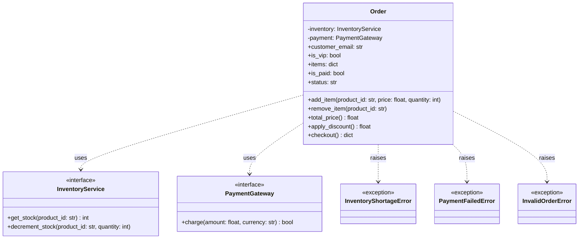
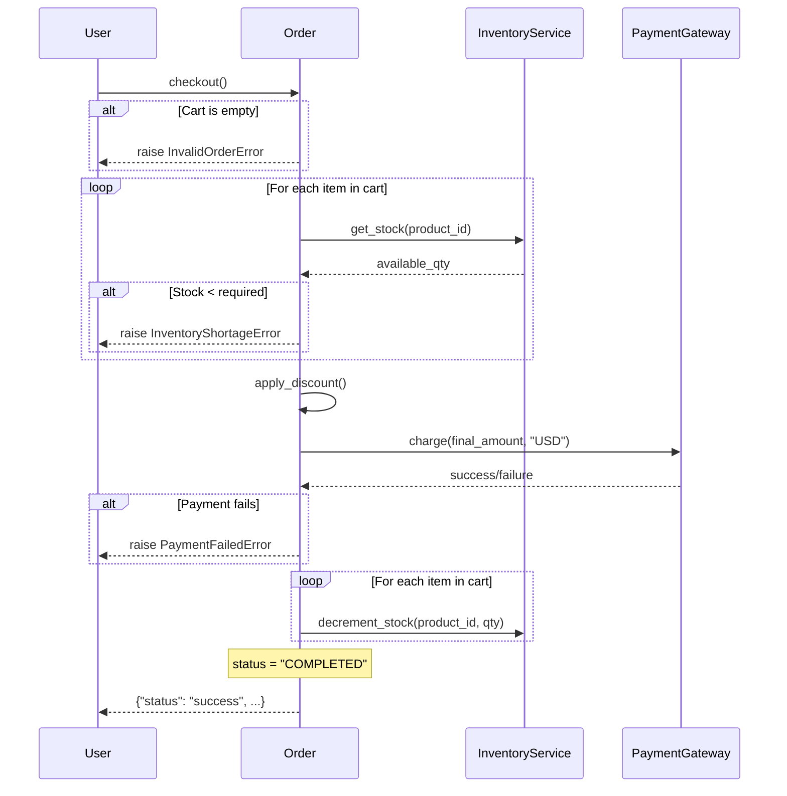

# Visual Analysis of [Order](file:///Users/nico/Documents/Progetti/ag-talk/06-test/02-da_testare.py#32-123) Class

This document provides a visual representation of the class structure and the checkout logic defined in [02-da_testare.py](file:///Users/nico/Documents/Progetti/ag-talk/06-test/02-da_testare.py).

## Class Diagram

The following diagram shows the relationships between the [Order](file:///Users/nico/Documents/Progetti/ag-talk/06-test/02-da_testare.py#32-123) class, its dependencies, and the custom exceptions.

## Checkout Sequence Diagram

The [checkout](file:///Users/nico/Documents/Progetti/ag-talk/06-test/02-da_testare.py#85-123) method orchestrates several steps. This diagram illustrates the flow of control and data.

